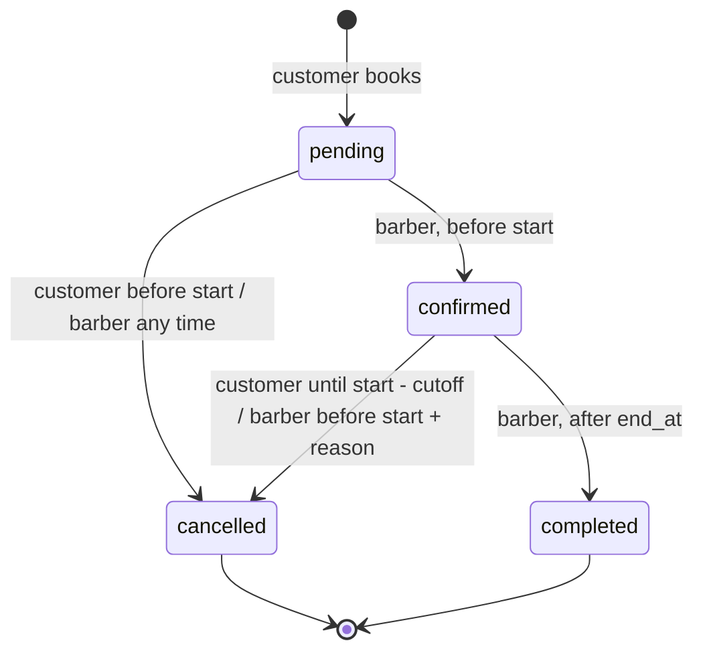

# Architecture

How Navbat is built and why. Decisions are recorded one by one in
[`decisions/`](decisions/); the schema is in [`database.md`](database.md) and every
risk handled is in [`edge-cases.md`](edge-cases.md).

## Layers and why
Routers (`app/api/v1`, `app/web`) → services (`app/services`) → models
(`app/models`) → PostgreSQL. Routers are thin; all business rules live in
services; the database enforces the invariants it can (see
[`database.md`](database.md)).

Cross-cutting pieces live in `app/core/`:

- **`config.py`**: `Settings` (pydantic-settings) reads every variable in
  `.env.example`; production refuses to start with the placeholder JWT secret.
- **`mail.py`**: sending one plain-text email. `SmtpMailer` (standard-library
  `smtplib`) when `SMTP_HOST` is set, otherwise `ConsoleMailer`, which logs the
  message. Business code takes a `Mailer` (a dependency tests override) and never
  opens a connection; a server problem is a `MailError`, logged with the cause and
  shown to nobody. Booking notices do not use it: they go through the outbox (ADR 0009).
- **`clock.py`**: business code takes `now` from an injected `Clock` rather than
  calling `datetime.now()`, so tests can freeze time at rule boundaries.
- **`errors.py`**: services raise `AppError(code, message, status_code, details)`
  and never build responses. Handlers turn that, validation errors, framework
  `HTTPException`s and unhandled exceptions into the single
  `{"error": {"code", "message", "details"}}` envelope.
- **`db.py`**: the engine and a session per request. Handlers take a
  `DbSession`; the request commits when the handler returns and rolls back if it
  raises (see [`database.md`](database.md) conventions and ADR 0003).

The health endpoint shows the pattern in miniature: the router
(`api/v1/health.py`) only calls `services/health.check_database`, which runs
`SELECT 1` and raises `AppError` on failure.

## Request lifecycle: create a booking
`services/booking.create_booking` (P6.2). The router only authenticates and
calls it; the request's session commits when the handler returns.

```mermaid
sequenceDiagram
    participant C as Customer
    participant R as Router
    participant S as booking.create_booking
    participant DB as PostgreSQL

    C->>R: POST /bookings
    R->>S: create_booking(customer, service, provider, start_at, now)
    S->>DB: load service, provider, settings, availability
    S->>S: booking_rules.validate_booking_start (422 on failure)
    S->>DB: pre-check overlap (provider, then customer)
    alt pre-check finds a clash
        S-->>C: 409 SLOT_TAKEN / CUSTOMER_OVERLAP
    else looks free
        S->>DB: SAVEPOINT; INSERT booking (pending) + booking_events
        alt a concurrent request won the race
            DB-->>S: SQLSTATE 23P01 (constraint name)
            S->>DB: ROLLBACK TO SAVEPOINT
            S-->>C: 409 SLOT_TAKEN (no_provider_overlap) / CUSTOMER_OVERLAP (no_customer_overlap)
        else inserted
            DB-->>S: ok
            S->>DB: INSERT outbox_messages (same transaction)
            S-->>R: booking
            R-->>C: 201 Created (commit)
        end
    end
```

The pre-check is only for a friendly message; the exclusion constraint is the
guarantee, because two requests can pass the pre-check at the same moment.

## Components
_P6.5 / P11.4._ Component diagram.

## Time model
_P4.1._ Three rules (ADR 0006):

- **Storage is UTC.** Every timestamp is `timestamptz`; the API rejects
  datetimes without an offset (`UtcDatetime` in `app/schemas/types.py`, 422) and
  converts any offset it accepts to UTC.
- **Availability is local.** Working hours are `time` / `date` values in the one
  business timezone (`business_settings.timezone`). `app/core/timezones.py` is
  the only place that turns them into instants:
  `local_to_utc`, `local_window_to_utc(day, start, end, tz)`,
  `local_day_bounds_utc(day, tz)` and `utc_to_local`.
- **Ranges are half-open `[start, end)`**, so a day's bounds are
  `[local midnight, next local midnight)` and neighbouring days tile exactly.

**Showing times (P10.3).** Nothing is ever shown as a bare clock reading.
API responses for bookings and slots carry the UTC instant, the same instant on
the business's clock with its offset (`local_start`, `local_end`), and the
`timezone` name (`BookingResponse.from_booking`, built with `utc_to_local`).
Pages print times on the business clock and name the zone and its offset *for
that date* (`utc_offset` / `day_offset` in `app/web/formatting.py`): ticket
and detail pages say "Asia/Tashkent · UTC+5", list rows end in a "UTC+5" tag, the
slot picker says which clock the chosen day is on. The offset comes from the
instant, not the zone, so it is right on both sides of a clock change. A small
script (`initTimezoneNote` in `app.js`) compares the browser's UTC offset with the
business's and, when they differ, shows "Your device is on Europe/Berlin
(UTC+2). Times on this page are Asia/Tashkent (UTC+5)." It is formatting only,
and hidden without JavaScript.

A local date is not a UTC date: 02:00 on 5 October in Tashkent is 21:00 UTC on
the 4th, so "bookings on the 5th" is always a query on `local_day_bounds_utc`,
never on `start_at::date`.

**DST policy** (Tashkent has none; this matters for other zones):

| Wall-clock time | Example (`Europe/Berlin`) | Result |
|---|---|---|
| Inside a spring-forward gap | 02:30 on 2026-03-29 does not exist | Moved forward to the first instant that exists: 03:00 CEST (01:00 UTC) |
| Inside a fall-back overlap | 02:30 on 2026-10-25 happens twice | The first occurrence (`fold=0`, summer time: 00:30 UTC) |

A window lying wholly inside a gap collapses to nothing (start == end) and
yields no slots. A window across a gap is an hour shorter than its wall-clock
length, and across an overlap an hour longer. Days are 23 or 25 hours long.

## Slot algorithm
_P5.1._ Slots are computed on request, never stored (ADR 0002). The pure part
lives in `app/services/slots.py` and does no I/O and no clock reads.

1. `build_windows_for_date(rules, exception, date, tz)` gives the provider's
   working windows for one local date as UTC `[start, end)` pairs. An exception
   replaces the weekly rules (day off = no windows; custom hours = one window).
2. `compute_slots(windows, busy, duration, granularity, now, lead_time,
   horizon_end)` steps candidate starts by `granularity` from each window start
   and keeps a candidate iff:
   - `[start, start + duration)` fits entirely inside the window;
   - it overlaps no busy interval (half-open, so back-to-back is fine);
   - `start >= now + lead_time` (inclusive) and `start < horizon_end`.
3. The result is sorted, de-duplicated UTC datetimes.

The grid is advisory. Two customers can be shown the same slot; the exclusion
constraint decides who gets it (ADR 0001). P5.2 loads the inputs; P6.1 reuses
the same rules to validate a requested start, so grid and validator agree.

## Booking lifecycle (state machine)
_P7.1._ `app/services/booking_state.py` is the only place that says which
status changes are legal. `check_transition` is pure (no DB, no clock); P7.2
applies an allowed change with a guarded UPDATE and writes the history event.



| From | To | Who | Condition | Error otherwise |
|---|---|---|---|---|
| pending | confirmed | the booking's barber | `now < start_at` | `INVALID_TRANSITION` |
| pending | cancelled | own customer | `now < start_at` | `CANCELLATION_CUTOFF_PASSED` |
| pending | cancelled | the booking's barber | none. Clears a *stale pending* booking (start passed): flagged in the barber's list, reason defaults to "not confirmed in time" (P7.7) | |
| confirmed | cancelled | own customer | `now <= start_at - cutoff` | `CANCELLATION_CUTOFF_PASSED` |
| confirmed | cancelled | the booking's barber | `now < start_at`, non-blank reason | `INVALID_TRANSITION` / `REASON_REQUIRED` |
| confirmed | completed | the booking's barber | `now >= end_at` | `TOO_EARLY_TO_COMPLETE` |

"The booking's barber" is the barber whose provider the booking is with
(`actor.provider_id == booking.provider_id`); another barber is not allowed any
of these. Every other (from, to) pair, and any role not listed, is
`INVALID_TRANSITION` (409). The cutoff comes from `business_settings.cancellation_cutoff_hours`.

**Applying a transition (`booking.transition`, P7.2).** Load the booking as the
actor (404 if not theirs), `check_transition`, then
`UPDATE bookings SET status = :to WHERE id = :id AND status = :expected`.
Zero rows updated means someone else changed it first: 409
`BOOKING_STATE_CHANGED`, and no event is written. Otherwise a `booking_events`
row (`from_status`, `to_status`, actor, reason) is inserted in the same
transaction, and a cancel also stores `cancelled_by_id` and `cancel_reason`.
See ADR 0008.

## Authentication
_P2.1–P2.5._ JWT in an HttpOnly cookie for the browser, Bearer for API
clients, CSRF double-submit for cookie requests (ADR 0005), login rate limiting.

**Primitives (`app/core/security.py`, P2.1).**

- Sign-in codes (ADR 0013, replacing passwords): `generate_login_code` (6 digits from
  `secrets`), `hash_login_code` (HMAC-SHA256 of address and code under `JWT_SECRET`, so a
  code is only valid for its address and a database copy does not show live codes) and
  `login_code_matches` (constant time).
- Tokens: HS256 JWT with `sub` (user id as a string), `iat`, `exp`; lifetime is
  `JWT_EXPIRE_MINUTES`. The token holds no role or active flag: those are
  reloaded from the database on every request (P2.3), so deactivating a user
  or changing a role takes effect at once.
- Decoding only accepts `HS256` (an explicit allow-list, which is what rejects
  `alg=none` and algorithm switching) and requires all three claims.
  Expired, tampered, foreign-secret, wrong-algorithm and malformed tokens all
  raise `InvalidTokenError` (401): code `TOKEN_EXPIRED` for expiry,
  `INVALID_TOKEN` for everything else.
- The clock is injected: both token functions take `now`. Expiry is compared
  against it by us rather than by PyJWT, which would use the real time. A token
  is valid while `now < exp`. There is no leeway and no check that `iat` is not
  in the future, since one process issues and verifies every token.

**Cookies and CSRF (`app/api/cookies.py`, `app/api/csrf.py`, P2.4).** Login sets
`access_token` (HttpOnly) and `csrf_token` (readable). `csrf_protect` runs on
every request app-wide: unsafe methods authenticated by the cookie, without a
Bearer header, must echo the CSRF cookie in `X-CSRF-Token` or a form field, else
403 `CSRF_FAILED`. Reasoning and trade-offs are in ADR 0005.

**Sign-in by emailed code (`services/auth.py`, `core/mail.py`, P12.2, ADR 0013).** Nobody
has a password. Signing up and in are the same two steps:

```mermaid
sequenceDiagram
    participant P as Person
    participant A as /auth (or /login pages)
    participant S as services/auth
    participant DB as PostgreSQL
    participant M as Mailer (SMTP / console)

    P->>A: register {email, name} or login {email}
    A->>S: request_*_code
    S->>DB: count recent codes (max 5 / 10 min), consume older codes, INSERT login_codes
    S->>M: send "your sign-in code is 482913" (only if there is an account to sign in to)
    A-->>P: 202, the same for every address
    P->>A: verify {email, code}
    A->>S: verify_code (IP limiter first)
    S->>DB: newest live code; wrong -> failed_attempts+1 and COMMIT
    S->>DB: UPDATE ... SET consumed_at WHERE consumed_at IS NULL (guarded claim)
    S->>DB: create the customer if it was a sign-up (unique index decides a race)
    A-->>P: token + cookies
```

- A request for a code answers the same for every address, and writes a row even when
  nothing is sent, so neither the answer nor the limit reveals who has an account.
- The three limits (per code, per IP and email, per address) and why a wrong try is
  committed by the service are in ADR 0013.
- `Mailer` is injected like the clock (`get_mailer`): tests read the code from a recording
  mailbox; development reads it from the app's log (`app/core/logs.py` makes the `navbat.*`
  loggers visible, since uvicorn only configures its own).

**Wrong-code rate limiting (`app/core/rate_limit.py`, `services/auth.verify_code`, P2.5, reworked in P12.2).**
A sliding window of wrong codes per (client IP, email), checked before the code is
compared. The store is an in-process dictionary behind a
three-method interface (`retry_after`, `record_failure`, `reset`), so a shared
store could replace it; the trade-off is that it resets on restart and is not
shared between instances. See `docs/api.md` for the exact behaviour.

**In the browser (`app/web/auth.py`, P8.2, reworked in P12.2).** `/login`, `/register`,
`/login/code` and `POST /logout` validate with the same schemas and call the same service
functions as `/api/v1/auth`, so the rules and the limits are shared; only
the answer differs (a re-rendered form or a 303 redirect instead of JSON).
Details worth knowing:

- The forms are posted before any login cookie exists, so they use
  the always-on `require_csrf`; `render()` gives every visitor a CSRF cookie on
  their first page, and a successful sign-in issues a fresh one.
- `/login` and `/register` redirect to `/login/code?email=...`, carrying the address (and,
  for a sign-up, the name, so "Send a new code" can repeat the sign-up) in the address
  of the page. It is not secret and proves nothing without the code; it keeps reload and
  the back button working without a session.
- `next` goes through `safe_next_path` (`app/web/redirects.py`): only a path
  on this site, never another host (open-redirect defence).
- A page GET that raises 401 redirects to `/login?next=<that page>`
  (`app/web/errors.py`), so any page that needs an account just takes
  `CurrentUser`.
- Every form works without JavaScript; the code field has `autocomplete="one-time-code"`
  and `inputmode="numeric"` so phones offer the code from the email.

## Why the web UI and the API share services
_P8.1. Decision: [ADR 0004](decisions/0004-server-rendered-ui.md)._

The browser UI is server-rendered Jinja2 served by the same FastAPI app.
`app/web/` routers are as thin as `app/api/v1/` ones: they call the same
service functions and hand the result to a template. So a rule (slot
availability, the double-booking check, a status transition) exists once, and
the pages cannot disagree with the API.

| Piece | Where | Job |
|---|---|---|
| Templates | `app/templates/` | `base.html` (layout, header, flash notice, confirm dialog), one file per page, `_partials/` for fragments JS swaps in. Formatting only |
| Rendering | `app/web/templating.py` | `render()` adds the shared context (CSRF token, current user, flash notice) and clears the flash cookie |
| Current user | `app/web/deps.py` | `load_current_user`, attached to every web router in `app/main.py`, so the header always knows who is looking |
| Form wording | `app/web/forms.py` | Turns a schema's validation error into one message per field, in the form's own words |
| Formatting | `app/web/formatting.py` | Jinja filters `money` (`60 000 UZS`, integer amounts, never rounded) and `duration` (`1 h 15 min`) |
| Paging | `app/web/paging.py` | `?page=N` for web lists on top of the services' limit/offset; a page past the end is 404 |
| Error pages | `app/web/errors.py` | Wording for the HTML error page; `app/core/errors.py` calls it for any path outside `/api/` |
| Styles | `app/static/css/app.css` | Every token (light + dark) and shared component. A page stylesheet may add components, never restyle these |
| Behaviour | `app/static/js/app.js` | One IIFE: theme toggle, mobile nav, confirm dialog, submit-once, inline email check, menu closing. Enhancement only |

**Which errors are pages.** `/api/*` always answers with the JSON envelope,
whoever asks. Every other path is a page a person reads, so a 404, a bad link
(422), a CSRF failure (403) or a crash (500) renders `error.html`. Our own
`AppError` messages are shown as written; a 500 never shows the exception.

**Flash notices.** A redirect after a form post ("Booking requested") leaves a
short-lived `flash` cookie holding a *key* into `FLASH_MESSAGES`, never text,
so a tampered cookie cannot put words on the page. The page that shows it
deletes the cookie.

**Without JavaScript.** Every page is complete HTML and every form posts
normally. An inline script in `<head>` adds `html.has-js` before first paint
(and applies the saved theme, to avoid a white flash); CSS shows JS-only
controls (theme and menu toggles) only under that class, so no dead buttons
appear when JS is off.

**Booking in the browser (`app/web/booking.py`, P8.4).** Three steps over the
same services: the picker (`GET /book/{id}`, public) shows `slot_query.get_slots`
as radio tiles grouped by person and part of the day; the confirm step
(`GET /book/{id}/confirm`, signed in) re-checks that the time is still free and
shows the ticket with the cancellation deadline from
`booking_state.cancellation_cutoff_at`; `POST /book/{id}` calls
`booking.create_booking`. A lost race (`SLOT_TAKEN`, `CUSTOMER_OVERLAP`) or a
broken booking rule re-renders the picker for that day with the reason, never an
error page. The live picker asks the same URL with `X-Requested-With` and gets
only `_partials/slot_grid.html`; responses carry `Vary: X-Requested-With`.

**My bookings (`app/web/my_bookings.py`, P8.5).** `/me/bookings` lists the
signed-in user's own bookings in Upcoming / Past tabs
(`booking.list_my_bookings`, names from `booking.describe_bookings`: two
queries for the whole page); `/me/bookings/{id}` shows the ticket, a
plain-language history from `booking.list_history`, and Cancel. Ownership is
`booking.get_own_booking`: someone else's booking, or a missing one, is the
same 404 page, barbers included. The Cancel button is drawn only when
`booking_state.can_cancel` says the server would accept it; that function calls
`check_transition`, so the button and the rule cannot drift apart. Past the
cutoff the page shows the deadline instead. `POST /me/bookings/{id}/cancel`
goes through `booking.transition`, so it is the same guarded UPDATE and
history row as the API; a 409 re-renders the booking with the reason.

**CSRF.** HTML forms are covered by the same app-wide `csrf_protect`
dependency as the API; forms carry the token in a `csrf_token` hidden field.

**Visual language ("tile and ticket").** Page titles sit on a band of cobalt
glaze, after Tashkent's tilework; the page itself is plain white (plain black in
dark mode), with no background pattern. A booking is drawn as a *navbat* ticket (the queue number you
take and wait to hear called): paper, a perforation, a torn edge and the time
printed large, on the confirm step and the booking's page. A barber's
portrait is framed as an *iwan*, the pointed arch of the niches around a
madrasa courtyard, with a thin cobalt rim (`.arch` in `app.css`); a barber
without a photo shows their initial in the same arch. The home page opens with
the shop in a row of rounded photos rising out of the band, the widest in the
middle, then the services and the barbers (each with a link per service they
offer). Saffron
means *committed or selected*: the chosen slot, a Confirmed status, the step
and page you're on, the button that books; red is only for cancelling and
errors; a barber-pole stripe only means "loading". Status chips always spell
the status and add a shape (dashed ring, tick, dot, strike), so colour is
never the only signal. Type is the owner's from Theoria: Archivo expanded
for titles and condensed for labels, Instrument Sans for reading, Spline Sans
Mono for times and prices. Every colour token is written once as
`light-dark(light, dark)` in `app.css`; the theme toggle only sets
`color-scheme`.

## Barber dashboard numbers

`services/dashboard.py` computes what `/barber` shows for the signed-in barber's
own provider (never the whole shop), on the business's local
calendar (Monday to Sunday weeks):

- **Bookings today**: the barber's bookings starting today that are not cancelled.
- **Waiting to be confirmed**: every pending booking of the barber's. One whose start has passed
  is flagged expired (`is_stale_pending`); it can only be cleared.
- **Utilization** = booked minutes ÷ available minutes for this week. Available =
  the barber's own working windows, zero while they are hidden (weekly rules, with exceptions and
  days off replacing them, via `slots.build_windows_for_date`). Booked = the
  duration snapshots of non-cancelled bookings starting this week. No availability
  shows a dash; the figure is capped at 100%.

The barber pages answer a customer with the 404 page, not a 403, so the area does
not advertise itself (`web/deps.require_barber_page`). Their addresses carry no
provider id (`/barber/hours`, `/barber/profile`): the provider is the signed-in
barber's own, so there is nothing to tamper with. The JSON API takes the id in the
path and checks it against the caller (`require_own_provider`, 403).

## Calendar file and notifications

**Calendar file (`services/calendar.py`, P10.1).** `render_ics` is pure: it
turns a booking, its service and provider names and the business name into an
RFC 5545 `VEVENT`. Both the API route (`GET /api/v1/bookings/{id}/ics`) and the
web route (`GET /me/bookings/{id}/ics`) authorise with the usual
`get_booking` / `get_own_booking` and then call `booking_ics`, so the file
format lives in one place. No library: the format is small and the tricky
parts (escaping, 75-octet folding) are unit-tested.

**Notifications (`services/notifications.py`, P10.2, ADR 0009).**
`booking.create_booking` and `booking.transition` call `notify_booking` right
after the change is flushed, for create, confirm and cancel (not complete). It
composes the text once (`compose_message`, pure: local time with the zone
named) and hands it to every notifier in `NOTIFIERS`:

- `OutboxNotifier` inserts an `outbox_messages` row **in the request's
  transaction**, so the message and the booking commit or roll back together.
  A booking refused by the exclusion constraint, or rolled back later, leaves
  no message; a committed booking cannot lose its message.
- `ConsoleNotifier` logs it (`navbat.notifications`), the development view. It
  is not transactional, so it is a log, not a record.

`Notifier` is a one-method protocol, so an SMTP sender is one more class, or a
worker that reads unsent rows (`sent_at IS NULL`) and delivers them. Neither is
built: no SMTP dependency. Only the customer is told; there is no business
email in the settings.

## Testing strategy
Three layers: unit (pure logic, no database), integration (API + real
Postgres), concurrency (threads + real commits). PostgreSQL always, because
the double-booking guarantee is a Postgres exclusion constraint that SQLite
cannot express.

The harness (`tests/conftest.py`, `tests/support.py`):

- **Schema once per run.** The test database's schema is dropped and rebuilt by
  running the Alembic migrations, so the tests exercise the real constraints.
- **Rollback per test.** The `db` fixture wraps each test in an outer
  transaction that is rolled back at the end; the session uses
  `join_transaction_mode="create_savepoint"`, so code under test can `commit()`
  and the data still disappears. The `client` fixture (API) shares that session.
- **Real commits for races.** `committing_db` hands out a session factory whose
  sessions commit for real, one connection per thread, and truncates all tables
  afterwards.
- **Frozen time.** `frozen_clock` overrides the injected clock (see Clock above).
- **Safety guard.** pytest refuses to start when `TEST_DATABASE_URL` equals
  `DATABASE_URL`, since the harness resets the test schema.

## Trade-offs accepted

What was chosen over something else, and what that costs. The reasoning for each is
in the ADR named.

- **Slots are computed on every request, not stored** (ADR 0002). Nothing to keep in
  sync when hours or durations change, and nothing to lock; the price is recomputing a
  day's grid per request. At one shop's scale that is a few queries.
- **Synchronous SQLAlchemy** (ADR 0003). Simpler to read and to test with real
  transactions; throughput per process is lower than with async. Not a bottleneck here.
- **Server-rendered pages with a little JavaScript** (ADR 0004). Every form works without
  JavaScript; there is no client-side state to get out of step with the server.
- **The database, not Python, stops double booking** (ADR 0001). The cost is that the
  guarantee needs PostgreSQL with `btree_gist`, so the tests run on PostgreSQL too and
  there is no SQLite shortcut.
- **Guarded `UPDATE`s instead of row locks for status changes** (ADR 0008). Losing a
  race is a clean `409`, never a wait; the caller must be ready to retry or reload.
- **Booking messages go to an outbox that nothing sends yet** (ADR 0009). The messages
  are durable and never describe a rolled-back booking, but no worker delivers them;
  only sign-in codes (ADR 0013) are actually emailed.
- **No passwords, no administrator** (ADR 0013, ADR 0010). Fewer secrets to leak and
  fewer roles to get wrong; signing in depends on a working mail account, and any barber
  can change the shared services and settings.
- **A barber's photo lives in Postgres** (ADR 0012). One backup, no object store; the
  rows are bigger (2 MB cap) and the column is deferred so lists never read it.
- **Vercel + Neon** (ADR 0014). A free live URL with no server to run; cold starts, a
  per-instance login rate limiter and PostgreSQL 18 in production against 16 in tests
  (see the README's known limitations).
