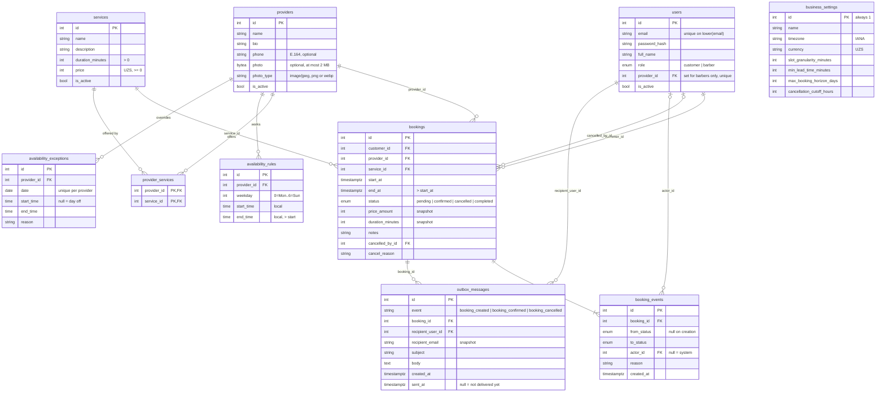

# Database

Complete for Phase 1 (P1.7); every later schema change updates it in the same
commit. Migrations: `0001` catalog/settings/availability, `0002` bookings and
events, `0003` the double-booking exclusion constraints.

## ER diagram



`business_settings` has no relationships: it is a single row of configuration.
Every foreign key is `ON DELETE RESTRICT`. `bookings` carries the two exclusion
constraints; `availability_rules` carries the third.

## Conventions

- **Time.** Every timestamp is `timestamptz`, stored and compared in UTC.
  `Base.type_annotation_map` maps every `Mapped[datetime]` to
  `DateTime(timezone=True)`, so a timezone-naive column cannot be declared by
  accident. Local wall-clock times (availability rules) are `time` / `date`
  columns and are converted in one module only (P4.1).
- **`created_at` / `updated_at`.** `TimestampMixin` adds both, set by the
  database clock (`server_default=now()`); `updated_at` is refreshed by
  `onupdate` on every UPDATE SQLAlchemy issues, ORM or Core.
- **Money** is an integer amount in UZS; the currency code lives on business
  settings. No floats, no `Decimal`.
- **Constraint names are predictable.** The naming convention in
  `app/models/base.py` (`pk_`, `fk_`, `uq_`, `ix_`, `ck_` prefixes) gives every
  constraint a stable name, because the API maps a violated constraint to a
  business error *by name* (`no_provider_overlap` → 409 `SLOT_TAKEN`). Every
  `CheckConstraint` must be given a `name=`; the exclusion constraints are named
  explicitly in the migration.
- **Soft deactivation.** Services, providers and users that bookings reference
  are never deleted; they get `is_active = false`. Foreign keys are
  `ON DELETE RESTRICT`, so the database refuses a hard delete anyway.
- **Migrations are the source of truth for the schema.** They are generated with
  `alembic revision --autogenerate`, then read and edited by hand: autogenerate
  cannot see exclusion constraints. The test harness builds its database with
  the same migrations, and `tests/integration/test_migrations.py` checks every
  migration can be upgraded, downgraded and upgraded again.
- **One transaction per request.** `get_db` (used through `DbSession`) commits
  when the handler returns and rolls back if it raises, so a booking and its
  `booking_events` row are written together or not at all. Services never call
  `commit()`; they call `flush()` when they need a constraint checked at that
  point (which is where the double-booking `23P01` is raised). `DbSession` uses
  `scope="function"` so the commit happens *before* the response is sent: a
  failed commit becomes a 500, never a success response for unsaved data.

## Tables

_Catalog, settings and availability tables (P1.2); bookings and their audit
trail (P1.3)._

Every table has `created_at` / `updated_at` (see Conventions). Constraint names
below are the real ones; CHECKs and unique indexes are declared on the models in
`app/models/`, exclusion constraints in the migrations.

### `users`
People who log in. `role` is the native enum `user_role` (`customer`, `barber`).
A barber runs exactly one provider: `provider_id` references `providers`, is unique
(`uq_users_provider_id`, one login per provider) and is set **if and only if** the
role is `barber` (`ck_users_barber_has_provider`, `(role = 'barber') = (provider_id
IS NOT NULL)`), so the database refuses a barber with no provider and a customer
with one. There is no administrator role (ADR 0010).
`is_active = false` deactivates an account without deleting the bookings that
reference it. Uniqueness of email is `uq_users_email_lower`, a unique index on
`lower(email)`, so `Ali@x.uz` and `ali@x.uz` are the same address.

### `business_settings`
Exactly one row: `ck_business_settings_single_row` requires `id = 1`, and the
primary key forbids a second row with that id. Holds the display name, IANA
`timezone`, `currency` (UZS), `slot_granularity_minutes`,
`min_lead_time_minutes`, `max_booking_horizon_days` and
`cancellation_cutoff_hours`. Each numeric column has a CHECK (granularity and
horizon > 0; lead time and cutoff >= 0) so a bad edit cannot make slot
generation loop or go negative.

### `services`
What is sold. `duration_minutes` (`ck_services_duration_positive`, > 0) and
`price` (`ck_services_price_not_negative`, >= 0, integer UZS). Names must not be
blank and are capped at 100 characters, descriptions at 1000. Deactivated, not
deleted; bookings copy price and duration (see Snapshot fields).

### `providers`
The barbers customers book. A provider row is created together with its barber's
user (`scripts/create_barber.py`) and managed by that barber alone. Soft
deactivation via `is_active`: a barber can hide themselves from customers.
`phone` is optional and stored in one shape only, E.164 (`+998901234567`):
`ck_providers_phone_e164` (migration `0006`) refuses spaces, a missing country
code and more than 15 digits, so every number shown is a working `tel:` link.
The API accepts the usual spellings and normalises them first
(`app/schemas/types.PhoneNumber`). `photo` is the barber's picture (`bytea`,
migration `0007`, ADR 0012) and `photo_type` its media type: both set or both
NULL (`ck_providers_photo_with_type`), only JPEG, PNG or WebP
(`ck_providers_photo_type_known`), at most 2 MB (`ck_providers_photo_size`).
The model marks `photo` as deferred, so listing providers never reads it.

### `provider_services`
Which provider offers which service. Composite primary key
`(provider_id, service_id)` makes a duplicate link impossible; both foreign keys
are `ON DELETE RESTRICT`.

### `availability_rules`
Weekly recurring windows in **local wall-clock time** (`time` columns, business
timezone). `weekday` is 0 = Monday … 6 = Sunday (`ck_availability_rules_weekday_range`),
and `ck_availability_rules_end_after_start` requires `end_time > start_time`, so
a window cannot cross midnight. Overlapping windows for the same provider and
weekday are rejected by the exclusion constraint `no_availability_rule_overlap`
(migration `0001`, over a `tsrange` of the two times); adjacent windows
(09:00–13:00 and 13:00–18:00) are allowed. The API (`services/availability.py`)
checks overlap first for a friendly `409 AVAILABILITY_OVERLAP`, locks the
provider row so concurrent writers queue, and maps a `23P01` from this
constraint to the same error. Whole-minute times on the slot grid are enforced
by the service, not the database, because the grid is a setting.

### `availability_exceptions`
A one-off override for one `date`: both `start_time` and `end_time` NULL means a
day off; both set means custom hours replacing the weekly rules for that date.
`ck_availability_exceptions_day_off_or_valid_hours` rejects one-without-the-other
and `end_time <= start_time`. `uq_availability_exceptions_provider_date` allows
one override per provider per date.

**Semantics.** For a date with an exception, the weekly rules are ignored
entirely (never merged): a day-off row closes the provider, a custom-hours row is
that date's only window. Exceptions live at most as far back as their date;
"past" is judged against *today in the business timezone*, so the API refuses to
create or edit a row once its local date has ended, but rows are kept for the
barber's history until deleted. The API also pre-checks the unique constraint for a
friendly `409` and maps the constraint's violation to the same error as the
backstop. Existing bookings are never modified by an exception.

### `bookings`
One appointment. `customer_id`, `provider_id` and `service_id` are
`ON DELETE RESTRICT` foreign keys, so nothing a booking refers to can be
hard-deleted. `start_at` / `end_at` are `timestamptz` (UTC) forming the
half-open range `[start_at, end_at)`; `ck_bookings_end_after_start` requires
`end_at > start_at`. `status` is the native enum `booking_status` (`pending`,
`confirmed`, `cancelled`, `completed`), defaulting to `pending`.
`price_amount` and `duration_minutes` are snapshots (see Snapshot fields).
`notes` is capped at 500 characters. `cancelled_by_id` and `cancel_reason` are
filled only on cancellation, and `ck_bookings_cancellation_fields_only_when_cancelled`
refuses them on any other status. The two exclusion constraints that prevent
double booking are added in P1.4.

Indexes: `ix_bookings_customer_start (customer_id, start_at)` serves "my
bookings"; `ix_bookings_provider_start (provider_id, start_at)` serves a
provider's day and the slot query; `ix_bookings_status` serves the barber's filter.

### `booking_events`
The audit trail behind booking history: one row per status change, written in
the same transaction as the change. `from_status` is NULL for the creation
event; `actor_id` is NULL when the system acted (for example expiring a stale
pending booking). Append-only by convention: nothing updates or deletes rows,
so it has `created_at` but no `updated_at`. Events written in one transaction
share `created_at` (`now()` is the transaction start), so ordering ties are
broken by `id`. `ix_booking_events_booking_created (booking_id, created_at)`
serves the history query. The three status columns share one Postgres enum type.

### `outbox_messages`
Notifications waiting for delivery (ADR 0009). A row is inserted in the same
transaction as the booking change it announces, so a rolled-back booking leaves
none. The recipient's email and the rendered subject and body are snapshots, so
changing the user's address or renaming the service later does not rewrite what
was sent. `sent_at` is NULL until a delivery worker (not built) sends it;
`ix_outbox_messages_unsent` is a partial index over exactly those rows.

## Constraints and indexes

Every constraint and index, with the reason it exists. Names are the real ones
(the API maps a violated constraint to an error by name).

| Constraint / index | Table | Why |
|---|---|---|
| `no_provider_overlap` (EXCLUDE) | `bookings` | One provider cannot have two overlapping pending/confirmed bookings → 409 `SLOT_TAKEN` |
| `no_customer_overlap` (EXCLUDE) | `bookings` | One customer cannot be in two places at once → 409 `CUSTOMER_OVERLAP` |
| `no_availability_rule_overlap` (EXCLUDE) | `availability_rules` | Overlapping weekly windows would make hours ambiguous and duplicate slots |
| `ck_bookings_end_after_start` | `bookings` | A booking must have positive length |
| `ck_bookings_price_not_negative`, `ck_bookings_duration_positive` | `bookings` | The snapshots must be valid on their own |
| `ck_bookings_cancellation_fields_only_when_cancelled` | `bookings` | Cancellation data on a live booking would falsify its history |
| `ck_services_duration_positive`, `ck_services_price_not_negative` | `services` | A zero-length or negatively priced service is nonsense |
| `ck_*_name_not_blank` | `services`, `providers`, `business_settings` | Names made only of spaces |
| `ck_providers_phone_e164` | `providers` | A phone number is `+` and 8-15 digits, country code first, or NULL |
| `ck_providers_photo_with_type`, `ck_providers_photo_type_known`, `ck_providers_photo_size` | `providers` | A photo always has its type, is a JPEG, PNG or WebP, and is at most 2 MB |
| `ck_availability_rules_weekday_range` | `availability_rules` | Weekday is 0–6 |
| `ck_availability_rules_end_after_start` | `availability_rules` | A window needs positive length |
| `ck_availability_exceptions_day_off_or_valid_hours` | `availability_exceptions` | Both times NULL (day off) or both set with end after start |
| `uq_availability_exceptions_provider_date` | `availability_exceptions` | One override per provider per date |
| `ck_business_settings_single_row` | `business_settings` | Exactly one settings row |
| `ck_business_settings_*` (granularity, lead time, horizon, cutoff) | `business_settings` | Values that would break slot generation or booking rules |
| `uq_users_email_lower` (unique index on `lower(email)`) | `users` | Emails are unique ignoring case |
| `pk_provider_services` (composite) | `provider_services` | A provider cannot offer a service twice |
| all `fk_*` | all | `ON DELETE RESTRICT`: referenced rows are deactivated, never deleted |
| `ix_bookings_customer_start` | `bookings` | "My bookings", ordered by time |
| `ix_bookings_provider_start` | `bookings` | A provider's day, and the slot query |
| `ix_bookings_status` | `bookings` | Barber filter by status |
| `ck_users_barber_has_provider` | `users` | A barber has a provider, and nobody else does |
| `uq_users_provider_id` | `users` | A provider has at most one login |
| `ix_booking_events_booking_created` | `booking_events` | A booking's history in order |
| `ck_outbox_messages_known_event` | `outbox_messages` | Only the three events the app sends |
| `ix_outbox_messages_unsent` (partial, `sent_at IS NULL`) | `outbox_messages` | A worker's "oldest unsent first" |
| `ix_outbox_messages_booking` | `outbox_messages` | Messages of one booking |

The three exclusion constraints also create GiST indexes, which is what makes
the overlap check fast as well as safe.

## The exclusion constraints, in plain language

A normal `UNIQUE` constraint says "no two rows may have the *same* value". An
**exclusion constraint** generalises it: "no two rows may have values that
*conflict*", where you choose what conflict means.

```sql
EXCLUDE USING gist (provider_id WITH =, tstzrange(start_at, end_at, '[)') WITH &&)
WHERE (status IN ('pending', 'confirmed'))
```

Read it as: *for any two bookings, if they have the same provider **and** their
time ranges overlap, reject the second one, but only look at pending and
confirmed bookings.*

- `provider_id WITH =` — same provider.
- `tstzrange(start_at, end_at, '[)') WITH &&` — build the time range and test
  whether the two ranges overlap (`&&` is Postgres's overlap operator).
- `'[)'` — half-open: the start belongs to the booking, the end does not. So
  10:00–10:30 and 10:30–11:00 do **not** overlap (back-to-back is fine).
- `WHERE status IN ('pending', 'confirmed')` — a cancelled or completed booking
  no longer occupies the time. The moment a booking is cancelled it drops out
  of the constraint and the slot is free again, with no cleanup code.

Why this beats "check, then insert": Postgres checks the constraint *while
inserting*, holding its own locks, so two simultaneous transactions cannot both
get through. The loser gets SQLSTATE `23P01` (`exclusion_violation`), which the
service turns into a friendly 409. The customer constraint is the same idea with
`customer_id` in place of `provider_id`. Plain integers work inside a GiST
constraint because of the `btree_gist` extension. See
[ADR 0001](decisions/0001-exclusion-constraints.md).

`no_availability_rule_overlap` is the same idea for weekly hours; `time` has no
range type, so both times are attached to a dummy date to make a `tsrange`.

## Snapshot fields

`bookings.price_amount` and `bookings.duration_minutes` are copied from the
service when the booking is made. If a barber later raises a price or shortens
a service, existing bookings keep the price and length the customer agreed to,
and their `[start_at, end_at)` ranges stay valid for the overlap constraints.
`service_id` says *what* was booked; the snapshot says *on what terms*. See
[ADR 0007](decisions/0007-booking-snapshots.md).
